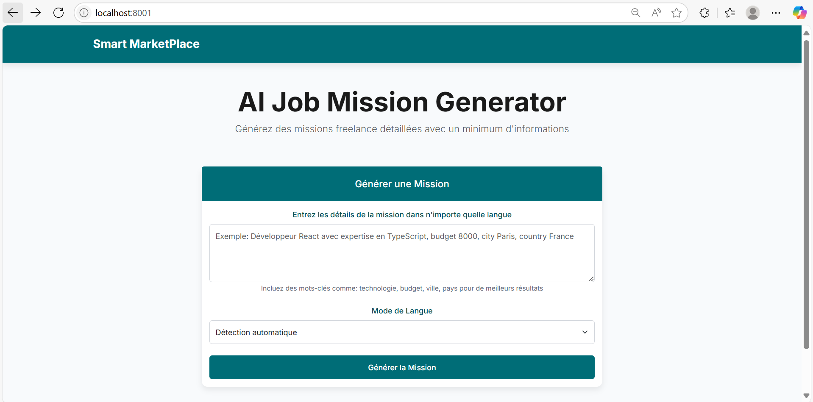
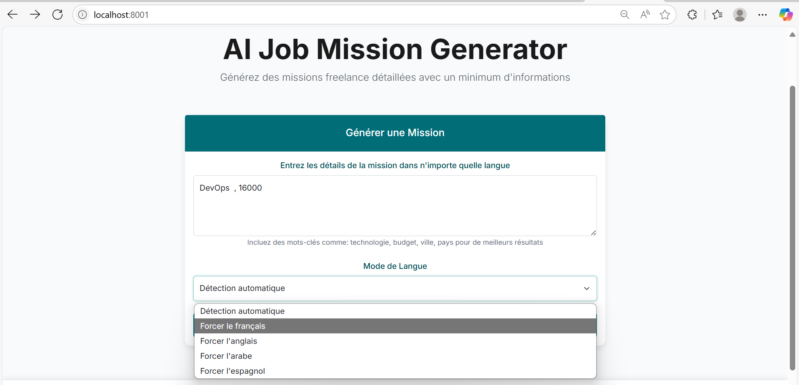
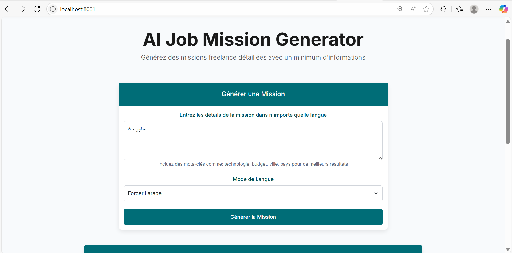
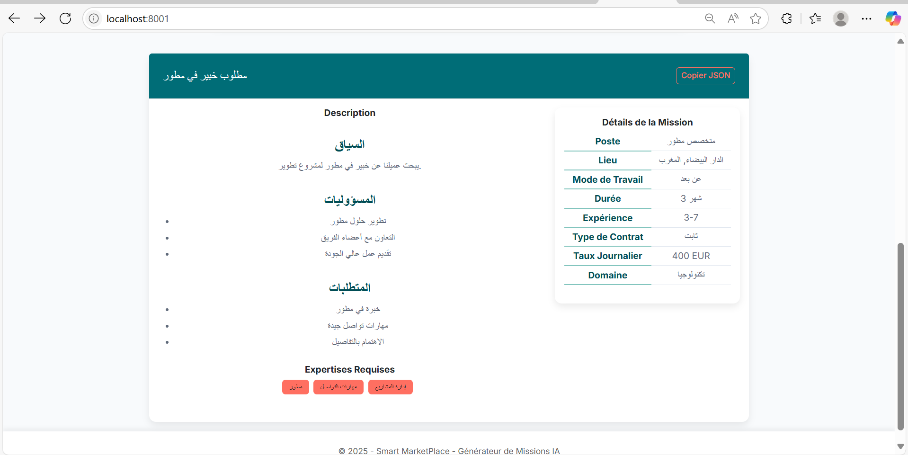

# Smart MarketPlace - Générateur de Missions IA

Une application web alimentée par l'IA qui génère intelligemment des missions freelance pour une plateforme de marché à partir d'une entrée naturelle minimale d'un client.

## Aperçu du Projet

Smart MarketPlace utilise le modèle Qwen2.5 via l'API OpenRouter pour générer des missions détaillées à partir d'entrées simples comme "développeur java". L'application se compose de :

- Backend API ASP.NET Core
- Frontend Razor Pages
- Intégration Python pour l'inférence du modèle IA via OpenRouter

## Architecture


### Composants :

1. **Frontend (SmartMarketPlace.Web)**
   - Interface utilisateur Razor Pages
   - Formulaire pour l'entrée utilisateur
   - Affichage des missions générées

2. **API Backend (SmartMarketPlace.API)**
   - Points de terminaison API REST
   - Intégration avec le script Python

3. **Intégration du Modèle IA (PythonScripts)**
   - Script Python pour l'intégration de l'API OpenRouter
   - Formatage des réponses JSON

4. **Modèles Partagés (SmartMarketPlace.Models)**
   - Modèles de données partagés entre les projets

## Instructions d'Installation

### Prérequis

- SDK .NET 8.0
- Python 3.8+ avec pip
- Git (optionnel)

### Étapes d'Installation

1. **Cloner le dépôt** (ou télécharger et extraire)
   ```
   git clone https://github.com/OumaimaBoughdad/Smart-marketplace.git
   cd smart-marketplace
   ```

2. **Installer les dépendances Python**
   ```
   cd PythonScripts
   pip install -r requirements.txt
   cd ..
   ```

3. **Compiler la solution .NET**
   ```
   dotnet build
   ```

4. **Exécuter le projet API**
   ```
   cd SmartMarketPlace.API
   dotnet run
   ```

5. **Exécuter le projet Web** (dans un nouveau terminal)
   ```
   cd SmartMarketPlace.Web
   dotnet run
   ```

6. **Accéder à l'application**
   - Interface Web : http://localhost:8001
   - Swagger API : http://localhost:7001/swagger


## Points de Terminaison API

### Générer une Mission
- **URL** : `/api/JobMission/generate`
- **Méthode** : POST
- **Corps de la Requête** :
  ```json
  {
    "prompt": "développeur java application web",
    "language": "french"
  }
  ```
- **Réponse** : Mission au format JSON

## Exemple d'Utilisation

1. Entrez un prompt comme "développeur java application web" dans le champ de saisie
2. Sélectionnez la langue souhaitée (Français ou Anglais)
3. Cliquez sur "Générer la Mission"
4. Consultez les détails de la mission générée
5. Copiez la sortie JSON si nécessaire

## Exemple d'Utilisation avec les captures d'écran



Où vous pouvez entrer une description pour générer une mission :




Choisissez la langue que vous préférez ou bien le système détecte la langue d'entrée et la marque comme langue d'affichage.
Et voilà notre mission :


Où vous pouvez aussi copier la réponse en format JSON.

Un autre exemple en arabe : 



la sortie : 




## Exemple de Sortie

```json
{
  "title": "Développeur Java Web Recherché",
  "description": "## Responsabilités\n- Développer et maintenir des applications web Java\n- Collaborer avec les équipes de design et backend\n- Implémenter des solutions robustes et évolutives\n- Participer aux revues de code et aux tests\n\n## Exigences\n- Solide expérience avec Java et les technologies web\n- Connaissance du Framework Spring, Hibernate\n- Compréhension des API RESTful\n- Expérience avec les technologies front-end (HTML, CSS, JavaScript)",
  "country": "France",
  "city": "Paris",
  "workMode": "REMOTE",
  "duration": 3,
  "durationType": "MOIS",
  "startImmediately": true,
  "startDate": "",
  "experienceYear": "3-7",
  "contractType": "CDI",
  "estimatedDailyRate": 400,
  "domain": "Technologie",
  "position": "Développeur Web Java",
  "requiredExpertises": ["Java", "Spring", "Hibernate", "API REST", "HTML/CSS", "JavaScript"]
}
```


## Licence

Ce projet est developee par Safae Hammouch et Oumaima Boughdad
