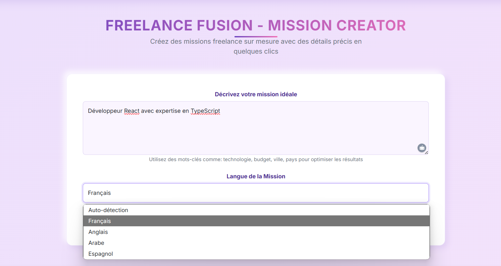

# Smart-MarketPlace

Une plateforme de freelance innovante permettant aux utilisateurs de créer et gérer des missions freelance sur mesure avec une assistance IA.

## À propos du projet

Smart-MarketPlace est une solution moderne pour connecter les freelances et les clients dans un environnement intuitif et efficace. Notre plateforme utilise l'intelligence artificielle pour faciliter la création de missions précises et détaillées, optimisant ainsi le processus de recrutement et de collaboration.

## Fonctionnalités principales

- **Création de missions assistée par IA** : Générez des descriptions de missions complètes à partir de simples mots-clés
- **Interface utilisateur moderne et intuitive** : Design responsive avec des composants neumorphiques
- **Support multilingue** : Disponible en Français, Anglais, Arabe et Espagnol
- **Système de matching intelligent** : Connecte les freelances aux projets les plus pertinents selon leurs compétences
- **Gestion de projet intégrée** : Outils de suivi et de communication pour une collaboration efficace

## Architecture technique

Le projet est structuré en trois composants principaux :
- **SmartMarketPlace.API** : API RESTful pour la gestion des données et l'intégration avec les services d'IA
- **SmartMarketPlace.Web** : Interface utilisateur web développée avec ASP.NET Core
- **SmartMarketPlace.Models** : Modèles de données partagés entre l'API et l'interface web

## Technologies utilisées

- ASP.NET Core 8.0
- Entity Framework Core
- Services d'IA pour la génération de contenu
- Bootstrap pour l'interface utilisateur
- Architecture MVC

## Installation et démarrage

1. Clonez le dépôt
```
git clone https://github.com/sihamErmk/Smart-MarketPlace.git
```

2. Restaurez les packages NuGet
```
dotnet restore
```

3. Exécutez le projet
```
dotnet run --project SmartMarketPlace.Web
```

## Captures d'écran





## Contributeurs

- Siham Ermk - 
- Yousra AKHAZZAN - 

## Licence

Ce projet est sous licence MIT.